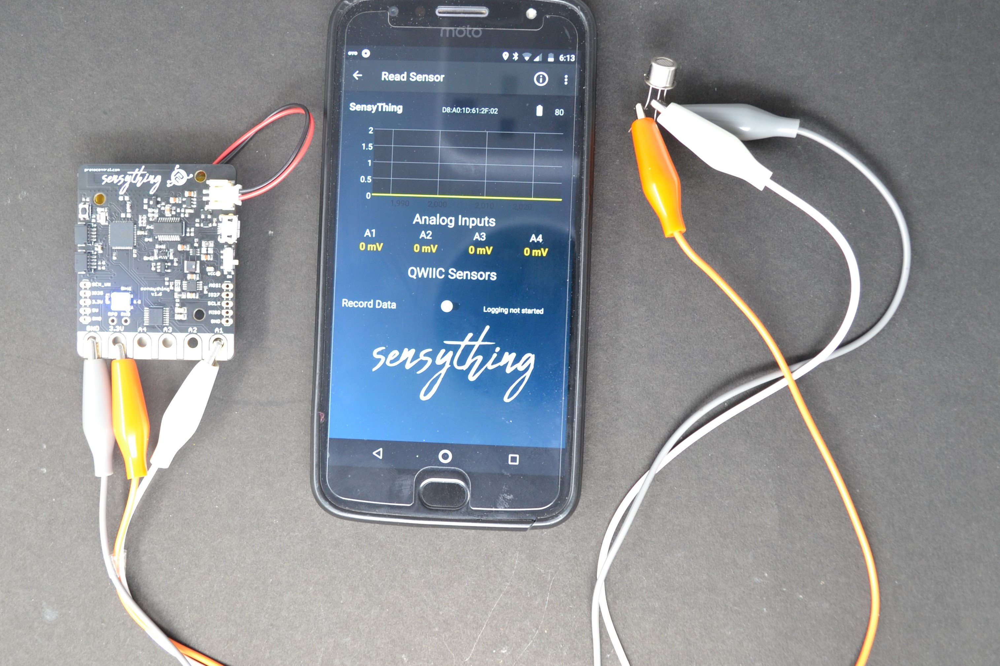

### Experiment 1 - Alcohol detector

#### * Objective
To determine the level of Alcohol in any liquid.

#### * Application
This sensor has a good level of sensitivity it can be used as a portable alcohol detector.

#### * Procedure
MQ303A is a semiconductor sensor for Alcohol detection. It has very good sensitivity and fast response to alcohol, suitable for portable alcohol detector just plugging with sensything. Below you find the conversion of ADC data to the content of alcohol to be detected with milligram per litre. When the content of alcohol is more than 0.8 it detects the presence of alcohol.



#### * Excerpts from the code:

```c
float adc_data = (float)((bit32*VFSR*1000)/FSR);     //In  mV
float v = (adc_data/10) * (5.0/1024.0);
float mgL = 0.67 * v;

if(mgL > 0.8)
{   
	Serial.print("mg/L : %f \n");
	Serial.print(" Alcohol Detected");
	Serial.println(mgL);
 }
else
{    
	Serial.print("mg/L : %f \n");
	Serial.print(" Alcohol Not Detected");
	Serial.println(mgL);
}  
```

[Download the Alcohol Sensor code](https://github.com/Protocentral/protocentral_sensything/tree/master/software/Sensything_Arduino/experiments/Analog_Sensors/examples/sensyThing_mq303A)

#### * Pin mapping and connection instructions:


<style type="text/css">
.tg  {border-collapse:collapse;border-spacing:0;}
.tg td{font-family:Arial, sans-serif;font-size:14px;padding:10px 5px;border-style:solid;border-width:1px;overflow:hidden;word-break:normal;border-color:black;}
.tg th{font-family:Arial, sans-serif;font-size:14px;font-weight:normal;padding:10px 5px;border-style:solid;border-width:1px;overflow:hidden;word-break:normal;border-color:black;}
.tg .tg-baqh{text-align:center;vertical-align:top}
.tg .tg-s268{text-align:left}
.tg .tg-nk0m{font-size:16px;font-family:Tahoma, Geneva, sans-serif !important;;text-align:left;vertical-align:top}
</style>
<table class="tg">
  <tr>
    <th class="tg-s268"><span style="font-weight:600">Sensything pin label</span></th>
    <th class="tg-nk0m"><span style="font-weight:600">Alcohol Sensor</span></th>
  </tr>
  <tr>
    <td class="tg-baqh">A1</td>
    <td class="tg-baqh">Analog out</td>
  </tr>
  <tr>
    <td class="tg-baqh">3V3</td>
    <td class="tg-baqh">VCC</td>
  </tr>
  <tr>
    <td class="tg-baqh">GND</td>
    <td class="tg-baqh">GND</td>
  </tr>
</table> 

&ensp;

<style type="text/css">
.tg  {border-collapse:collapse;border-spacing:0;}
.tg td{font-family:Arial, sans-serif;font-size:14px;padding:10px 5px;border-style:solid;border-width:1px;overflow:hidden;word-break:normal;border-color:black;}
.tg th{font-family:Arial, sans-serif;font-size:14px;font-weight:normal;padding:10px 5px;border-style:solid;border-width:1px;overflow:hidden;word-break:normal;border-color:black;}
.tg .tg-u8t5{font-family:Tahoma, Geneva, sans-serif !important;;text-align:center}
.tg .tg-0lax{text-align:left;vertical-align:top}
</style>
<table class="tg">
  <tr>
    <th class="tg-u8t5"><span style="font-weight:bold">Connection Instructions</span></th>
  </tr>
  <tr>
    <td class="tg-0lax">- Place the alcohol sensor to any of the analog pins A1, A2, A3 and A4.</td>
  </tr>
  <tr>
    <td class="tg-0lax">- Here we are using A1.</td>
  </tr>
  <tr>
    <td class="tg-0lax">- Connect VCC of MQ303A with VCC in Sensything.</td>
  </tr>
  <tr>
    <td class="tg-0lax">- Connect GND of sensor with GND in Sensything.</td>
  </tr>
  <tr>
    <td class="tg-0lax">- Connect output of sensor with Analog 1 in Sensything.</td>
  </tr>
</table>
