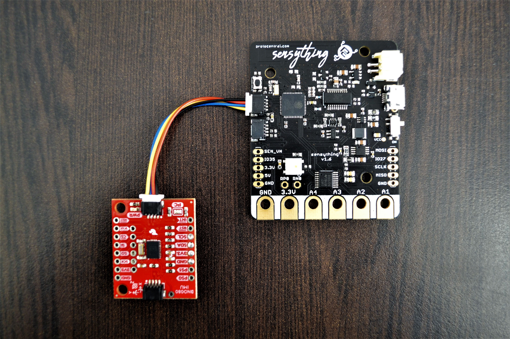

### Experiment 1 - Measuring Acceleration

#### * Introduction
Accelerometer sensor(BNO080) with sensything is used for measuring acceleration, which is the rate of change of the velocity of an object. This measure in meters per second squared (m/s2) or in G-forces (g). A single G-force for us here on planet Earth is equivalent to 9.8 m/s2, but this does vary slightly with elevation (and will be a different value on different planets due to variations in gravitational pull). 

#### * Objective
To determine the sensing vibrations using sensything in systems or for orientation applications.

#### * Application
The accelerometer sensor(BNO080) can be used for service robots such as cleaners that employ Simultaneous Localization And Mapping (SLAM) or other ‘intelligent’ navigation solutions and automated projects.

#### * Procedure
BNO080 accelerometer sensor is used for measuring acceleration. It integrates a triaxial 12-bit accelerometer with a range of ±8g, the sensor can be interfaced with sensything using Qwiic connector very quick or just plug to read data from sensor. Once you upload the code given below using Arduino IDE to your sensything you will can read the x,y and z axes data printed in your serial monitor. Also, be sure to check out the labeling on the front of the board that indicates the orientation of the positive X, Y, and Z axes so you know which way your data is pointing.



#### * Excerpts from the code:

```c
float x = myIMU.getAccelX();         // Accelerometer reading of X
float y = myIMU.getAccelY();         // Accelerometer reading of Y
float z = myIMU.getAccelZ();         // Accelerometer reading of Z
```

#### * Pin mapping and connection instructions:

<style type="text/css">
.tg  {border-collapse:collapse;border-spacing:0;}
.tg td{font-family:Arial, sans-serif;font-size:14px;padding:10px 5px;border-style:solid;border-width:1px;overflow:hidden;word-break:normal;border-color:black;}
.tg th{font-family:Arial, sans-serif;font-size:14px;font-weight:normal;padding:10px 5px;border-style:solid;border-width:1px;overflow:hidden;word-break:normal;border-color:black;}
.tg .tg-baqh{text-align:center;vertical-align:top}
.tg .tg-s268{text-align:left}
.tg .tg-nk0m{font-size:16px;font-family:Tahoma, Geneva, sans-serif !important;;text-align:left;vertical-align:top}
</style>
<table class="tg">
  <tr>
    <th class="tg-s268"><span style="font-weight:600">Sensything pin label</span></th>
    <th class="tg-nk0m"><span style="font-weight:600">Alcohol Sensor</span></th>
    <th class="tg-nk0m"><span style="font-weight:600">Colour</span></th>
  </tr>
  <tr>
    <td class="tg-baqh">SDA</td>
    <td class="tg-baqh">Serial Data</td>
    <td class="tg-baqh">Blue</td>
  </tr>
  <tr>
    <td class="tg-baqh">SCL</td>
    <td class="tg-baqh">Serial Clock</td>
    <td class="tg-baqh">Yellow</td>
  </tr>
  <tr>
    <td class="tg-baqh">3V3</td>
    <td class="tg-baqh">3v3</td>
    <td class="tg-baqh">Red</td>
  </tr>
  <tr>
    <td class="tg-baqh">GND</td>
    <td class="tg-baqh">GND</td>
    <td class="tg-baqh">Black</td>
  </tr>
</table> 

&ensp;

<style type="text/css">
.tg  {border-collapse:collapse;border-spacing:0;}
.tg td{font-family:Arial, sans-serif;font-size:14px;padding:10px 5px;border-style:solid;border-width:1px;overflow:hidden;word-break:normal;border-color:black;}
.tg th{font-family:Arial, sans-serif;font-size:14px;font-weight:normal;padding:10px 5px;border-style:solid;border-width:1px;overflow:hidden;word-break:normal;border-color:black;}
.tg .tg-u8t5{font-family:Tahoma, Geneva, sans-serif !important;;text-align:center}
.tg .tg-0lax{text-align:left;vertical-align:top}
</style>
<table class="tg">
  <tr>
    <th class="tg-u8t5"><span style="font-weight:bold">Connection Instructions</span></th>
  </tr>
  <tr>
    <td class="tg-0lax">- It is a Quick and Qwiic connection with sensything</td>
  </tr>
  <tr>
    <td class="tg-0lax">- Plug the Qwiic Connector for interface between sensor and sensything.</td>
  </tr>
     <tr>
    <td class="tg-0lax">- Upload the code using Arduino IDE and read accelerometer readings.</td>
  </tr>
</table>


[Download the Accelerometer Sensor code](https://github.com/Protocentral/protocentral_sensything/tree/master/software/Sensything_Arduino/experiments/Qwiic/BNO080)
