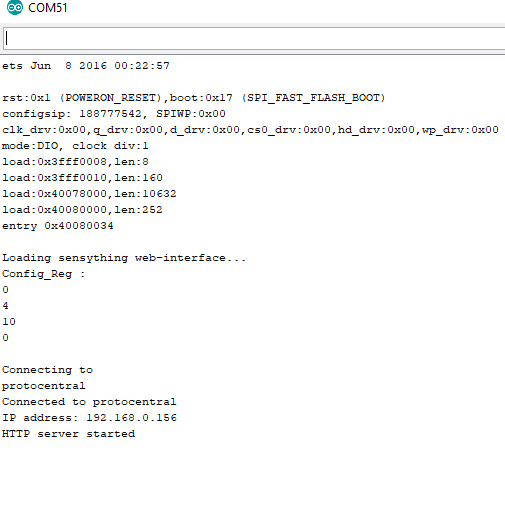

### Sensything as a Web server

The web server came into being to eliminate the need to install any software or application to display sensor values. With a small addition to the programming section, you would be able to read the sensor values on your system. To get started you can follow the basic steps mentioned below to understand how it would work.

#### How to Use Sensything as a Web Server

By equipping Sensything you can turn it into a web server. By accessing that server with a browser running on any computer connected to the same network or the soft-AP available in sensything you can

**Read a value of a sensor (using simple HTML)**

**Step 1: Writing Code to Web Server**

Now you can upload/write the code, and it will work straight away. You can create an HTML page for displaying the sensor values, read the HTML contents and send the analog values to the web page.
```c

 String adcValue = MAIN_page; //Read HTML contents
 server.send(200, "text/html", adcValue); //Send web page

```

The ADC value is read from analog channels of sensything and the ADC data is sent to the browser while HTTP data request from the server.

 ```c

  adc_data=pc_ads1220.Read_SingleShot_SingleEnded_WaitForData(MUX_SE_CH0);
  String adcValue = String(convertToMilliV(adc_data));
  server.send(200, "text/plane", adcValue); //Send ADC value only to client ajax request

 ```
 Creating an HTTP request object in the browser to request ADC value from server and process the returned ADC value to update the web page.

 ```c
  var xhttp = new XMLHttpRequest();
  xhttp.onreadystatechange = function() {
  if (this.readyState == 4 && this.status == 200) {
  document.getElementById("ADCValue").innerHTML =
  this.responseText;
```
Don't forget to check if you have the ESP32 Dev Module(Sensything) board and Sensything COM port selected, otherwise you will get an error when trying to upload. Open the Serial Monitor at a baud rate of 115200.

**Step 2: Finding the ESP IP Address**

Press the sensything ON/OFF button and it will output the ESP IP address once the code is uploaded on the Serial Monitor.



**Step 3: Accessing the Web Server**

Open your browser, type the ESP IP address, and you’ll see the following page. This page is sent by the sensything when you make a request on the ESP IP address. If you take a look at the browser, you can see what is going on in the background. The ESP receives an HTTP request from a new client and displays the analog values.

**Step 4: Testing the Web Server**

Let’s test the web server. Connect the analog sensors with sensything and get the live readings of channels in the web server.


[Download the Web server code](https://github.com/Protocentral/protocentral_sensything/tree/master/software/Sensything_Arduino/sensything_web/examples/sensything_web)
