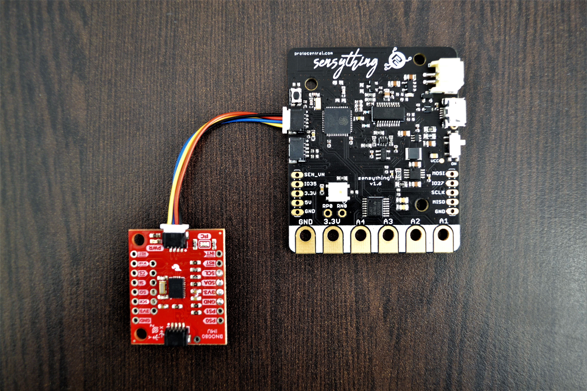

---
menu: Experiment 3 - Activity Classifier
parent: Connecting-qwiic-sensors.md
weight: 2
--- 

### Experiment 3 - Activity Classifier

#### * Introduction
Activity classification is the task of identifying a pre-defined set of physical actions using motion-sensory inputs. The activity classifier is somewhat similar to the stability classifier which it uses the on-board cortex in the sensor .to determine. 

#### * Objective
To determine what activity the IMU is doing and create a model using Sensything to classify physical activities done by users or the system.

#### * Application
The BNO080 Inertial Measurement Unit (IMU) can be used to monitor activity levels for health applications, the daily physical activity of human-beings with motion-sensory inputs.

#### * Procedure
BNO080 sensor is used as an activity classifier, the sensor data is combined and drift corrected into meaningful, accurate IMU information. It is perfect for any project that needs to sense orientation or motion. The sensor can be interfaced with Sensything using the Qwiic connector, which makes it very quick to just plug in to read data from sensor. Once you upload the code given below using the esp-idf to your Sensything,you will get the activity classification based on your input or movement in the motion-sensory input. Hence the data will be printed on your serial monitor. 



#### * Excerpts from the code:

```c
uint32_t enableActivities = 0x1F; //Enable all 9 possible activities including Unknown
_activityConfidences = activity;
    
activity_data.activity_values = activityClassifier;
const uint8_t mostLikelyActivity = activity_data.activity_values;
printActivityName(mostLikelyActivity);             

```

#### * Pin mapping and connection instructions:

<style type="text/css">
.tg  {border-collapse:collapse;border-spacing:0;}
.tg td{font-family:Arial, sans-serif;font-size:14px;padding:10px 5px;border-style:solid;border-width:1px;overflow:hidden;word-break:normal;border-color:black;}
.tg th{font-family:Arial, sans-serif;font-size:14px;font-weight:normal;padding:10px 5px;border-style:solid;border-width:1px;overflow:hidden;word-break:normal;border-color:black;}
.tg .tg-baqh{text-align:center;vertical-align:top}
.tg .tg-s268{text-align:left}
.tg .tg-nk0m{font-size:16px;font-family:Tahoma, Geneva, sans-serif !important;;text-align:left;vertical-align:top}
</style>
<table class="tg">
  <tr>
    <th class="tg-s268"><span style="font-weight:600">Sensything pin label</span></th>
    <th class="tg-nk0m"><span style="font-weight:600">BNO080 Sensor</span></th>
    <th class="tg-nk0m"><span style="font-weight:600">Colour</span></th>
  </tr>
  <tr>
    <td class="tg-baqh">SDA</td>
    <td class="tg-baqh">Serial Data</td>
    <td class="tg-baqh">Blue</td>
  </tr>
  <tr>
    <td class="tg-baqh">SCL</td>
    <td class="tg-baqh">Serial Clock</td>
    <td class="tg-baqh">Yellow</td>
  </tr>
  <tr>
    <td class="tg-baqh">3V3</td>
    <td class="tg-baqh">3v3</td>
    <td class="tg-baqh">Red</td>
  </tr>
  <tr>
    <td class="tg-baqh">GND</td>
    <td class="tg-baqh">GND</td>
    <td class="tg-baqh">Black</td>
  </tr>
</table> 

&ensp;

<style type="text/css">
.tg  {border-collapse:collapse;border-spacing:0;}
.tg td{font-family:Arial, sans-serif;font-size:14px;padding:10px 5px;border-style:solid;border-width:1px;overflow:hidden;word-break:normal;border-color:black;}
.tg th{font-family:Arial, sans-serif;font-size:14px;font-weight:normal;padding:10px 5px;border-style:solid;border-width:1px;overflow:hidden;word-break:normal;border-color:black;}
.tg .tg-u8t5{font-family:Tahoma, Geneva, sans-serif !important;;text-align:center}
.tg .tg-0lax{text-align:left;vertical-align:top}
</style>
<table class="tg">
  <tr>
    <th class="tg-u8t5"><span style="font-weight:bold">Connection Instructions</span></th>
  </tr>
  <tr>
    <td class="tg-0lax">- It is a Quick and Qwiic connection with sensything</td>
  </tr>
  <tr>
    <td class="tg-0lax">- Plug the Qwiic Connector for interface between sensor and sensything.</td>
  </tr>
     <tr>
    <td class="tg-0lax">- Upload the code using esp-idf toolchain to your sensyhting board.</td>
  </tr>
  <tr>
    <td class="tg-0lax">- Get the activity classifier of defined sensor - inputs based on sensor movement. </td>
  </tr>
</table>


[Download the bno080 Activity Classifier Sensor code]()
