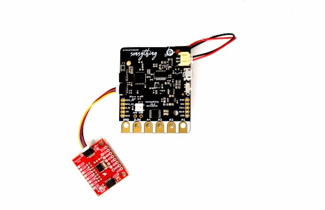

# **Why Qwiic?**

    

[Qwiic functionality](https://www.sparkfun.com/qwiic) was first devised by Sparkfun. If you ask why Qwiic? It makes prototyping easy and less complex.With Sensything we have built-in support for popular Qwiic sensors. With a list of sensors and connectors in the Qwiic section, you can use multiple sensors at the same time using the [Daisy chain](https://en.wikipedia.org/wiki/Daisy_chain_(electrical_engineering)) method. With two Qwiic slots provided on the board, you can keep going.

## Using Qwiic connect system with Sensything

The Qwiic connect option with Sensything makes sensor plug ins a whole lot easier. With the board in hand, we would be able to pre-program for a list of Qwiic sensor. This would make it more suitable to plug in, detect the sensor and the load the code automatically. We will be updating this section. 

    

You can find an example for a Qwiic sensor experiment in

- [Experiment 3](https://sensything.protocentral.com/3-pressure-sensor.html)
