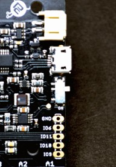

# Basic pointers

* How do i turn on the device?

Firstly connect the battery to the Sensything board, Then switch on the board.

| Situation                        | Solution                                                                                                                             |
|----------------------------------|--------------------------------------------------------------------------------------------------------------------------------------|
| How do i charge the battery?     | Ensure that the battery is plugged to the Board and then connect the USB cable.  You can use a 5v power adapter as the power source. |
| How do i upload the code?        | Check if the switch is turned ON                                                                                                     |
|                                  | Select the COM port and the board                                                                                                    |
|                                  | Check for the latest version of Arduino IDE & ESP-idf                                                                                |
|                                  | Configure the software                                                                                                               |
| How do i get the channel values? | Check for the latest firmware on Github                                                                                              |
|                                  | If you find any improper values, then give a fixed input to all channels                                                             |
|                                  | Test if the 3.3v and the 5v source power is proper                                                                                   |
| How does the BLE communication happen?      | Once connected through the BLE, the RGB LED will turn off.                                                                              |
|                                  | When it is disconnected then the RGB LED turns on      

# Troubleshooting 

| Issue                                      | Solution                                                        |
|--------------------------------------------|-----------------------------------------------------------------|
| If the port is not found?                  | You can unplug the USB cable and plug it again                  |
|                                            | Try changing the USB cable                                      |
|                                            | Try again with a different system                               |
| If there is an uploading problem           | Check the USB connection                                        |
| If the RGB does not power up               | Check for latest firmware on Github                             |
| What are the  issues with channel values ? | No values                                                       |
|                                            | Wrong values                                                    |
|                                            | In case of noise (Disturbance between channels)                 |
|                                            | Cross talk may happen if there is unused GND                    |
| What if Bluetooth is not detected?         | Check if your mobile device supports BLE                        |
|                                            | Check the whether the device is within the prescribed BLE limit |

