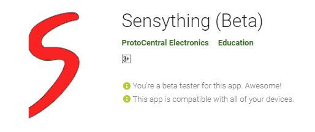

The Sensything board comes with the feature -

**Bluetooth 4.2 / Bluetooth Low Energy (BLE) compatible**

In order for the device to connect with the Sensything Application, the Arduino code must be set up.

### How to set up sensything as BLE server?

The Bluetooth Low Energy(BLE)  primary application is short distance transmission of small amounts of data (low bandwidth). The Sensything and it’s mobile application has been designed to simplify the sensor values in your smart devices. With the inbuilt ADC (ADS1220) the precise values can be displayed and monitored. The Sensything comes out with Bluetooth Low Energy (BLE). This is a quick introduction to use sensything as BLE. First, we’ll explore how BLE works with sensything and setting up sensything as BLE Server. Few simple steps:

->Create a BLE Server. In this case, sensything acts as a BLE server.
->Create a BLE Service.Create a BLE Characteristic on the Service.
->Create a BLE Descriptor on the Characteristic.
->Start the Service.
->Start advertising, so it can be found by other devices.


### Step 1: Writing the code
Using the Arduino IDE, write the code for the sensor of your choice and monitor the live values in the sensything mobile application. Refer to the above mentioned code for sensything with ble to get tips on writing/uploading the code.

You need to define a UUID for the Service and Characteristic.
```c
#define SERVICE_UUID        "cd5c1105-4448-7db8-ae4c-d1da8cba36d0"
#define CHARACTERISTIC_UUID "cd5c1106-4448-7db8-ae4c-d1da8cba36d0"
```
Then, you create a BLE device called “Sensything”. You can change this name to whatever you like.Create the BLE Device
```c
BLEDevice::init("Sensything");
```
In the following line, you set the Sensything as a server.
```c
BLEServer *pServer = BLEDevice::createServer();
```
After that, you create a service for the BLE server with the UUID defined earlier.

 ```c
 BLEService *pService = pServer->createService(SERVICE_UUID);
 ```
 
Then, you set the characteristic for that service. As you can see, you also use the UUID defined earlier, and you need to pass as arguments the characteristic’s properties. In this case, it’s: READ and WRITE.

Now you can get the adc data from sensything 4 different channels and send the data value through ble packet format and display the live values in the sensything mobile application.

```c
adc_data=pc_ads1220.Read_SingleShot_SingleEnded_WaitForData(MUX_SE_CH0); // Getting analog channel 1 value
float vout = convertToMilliV(adc_data);

int32_t ble = (int32_t) (vout * 100);
ads1220_data[0]= (uint8_t) ble;
ads1220_data[1]= (uint8_t) (ble >> 8);
ads1220_data[2]= (uint8_t) (ble >> 16);
ads1220_data[3]= (uint8_t) (ble >> 24);
```
    
After creating the characteristic, you can set the ads1220 value with the setValue() method.   

```c
// notify changed value
if (deviceConnected ) {
pCharacteristic->setValue(ads1220_data, 16);
pCharacteristic->notify(); 
}
```
    
Now that Arduino IDE is all set up, download the sensything ble code provided in the github and open the sketch provided for this tutorial (link below).This example works with the sensything application on your phone. Make sure to install the app to follow along with this example.

### Step 2: Connecting the sensor
The next step is to connect the sensors to the Sensything board. Sensors that can be used along with sensything are both Analog and Qwiic. Hence you can choose sensor of your choice based on your application and can get the sensor values through BLE.You can refer the experiments provided as examples.

 <p align="center">    </p>
 
### Step 3: Uploading the code  
Connect the Sensything board to your system using a USB cable. Once the code is selected in Arduino IDE you should select Tools / Board. Choose "ESP32 Dev Module" for sensything board. Also go ahead and choose the correct COM port after connecting the board to your computer then upload the code to your sensything board.

 <p align="center">    </p>
 
### Step 4: Using the Sensything Application
You can download the sensything android application from android playstore, and once you open the application and connect to the BLE device(Sensyhting) you can see the live analog channel/sensor values in the sensything mobile application.

 <p align="center">    </p>

Kindly refer to the Introduction video on how to download the Application and how to connect.
http://sensything.protocentral.com/#making-the-connections

### Step 5: Reading the sensor values
The sensor values are displayed in sensything mobile application which can also be monitored live based on different application.

Kindly refer to the Application section on the main page
http://sensything.protocentral.com/#understanding-the-sensything-application
