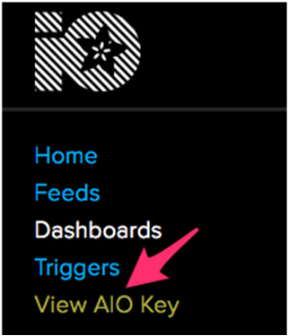
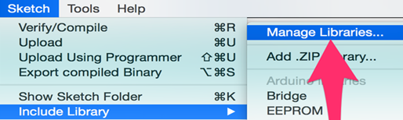
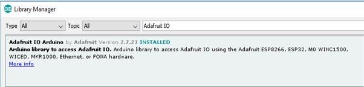
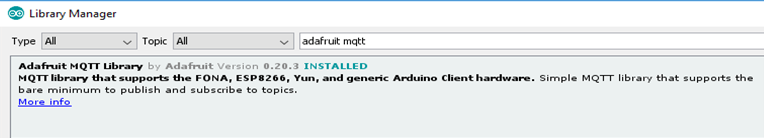
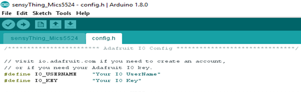
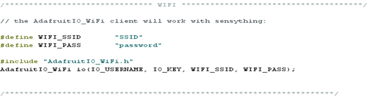
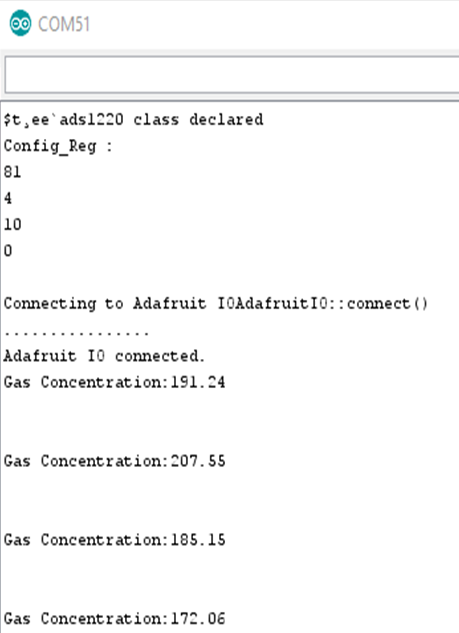
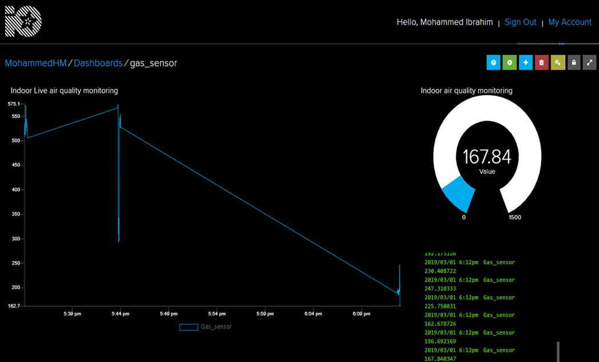
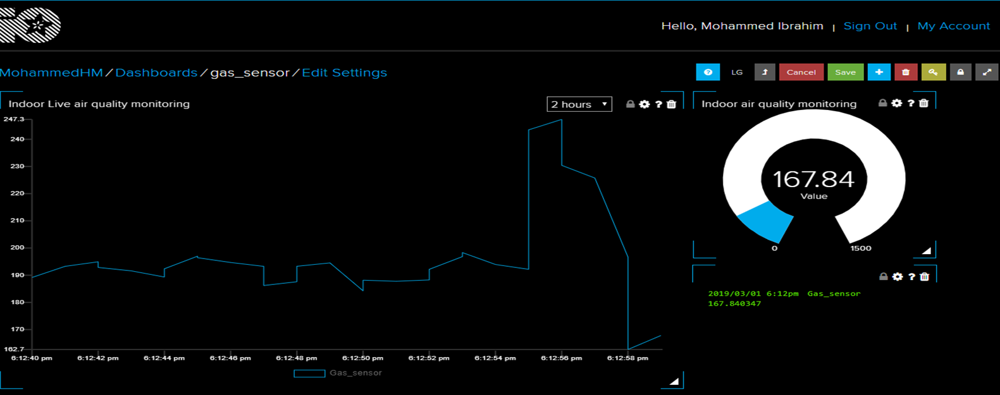

## Sensything as an IOT device


### *Overview

Sensything along with adafruit IO is used for storing and then retrieving data but it can do a lot more than just that!

* Display your gas sensor data measuring gas density in real-time, online
* Make your experiment internet-connected by reading sensor data
* Connect projects to web services like Twitter, RSS feeds, weather services, etc.
* Connect your project to other internet-enabled devices

### * Sensything Wiring
You will need the following parts for this tutorial, but it’s just Plug & Play with Sensything…..!Ready to give a try:


* 1x Sensything
* 1x Mics5524 gas sensor
* 3x Alligator Cables
* 3x jumper wires

We will need to connect the following pins from Sensything to Mics5542 :
* Sensything 3V to Pin 1 of the Mics5524
* Sensything  GND to Pin 2 of the Mics5524
* Sensything  A1 to Pin 3 of the Mics5524 

### * Adafruit IO Setup
The first thing you will need to do is to login to Adafruit IO and visit the Settings page. Click the VIEW AIO KEY button to retrieve your key.A window will pop up with your Adafruit IO Key. 

		

### *Creating the Feeds 
First, you will need to create a feed, If you need help getting started with creating feeds on Adafruit IO, check out the Adafruit IO Feed Basics guide.

	

### * Arduino Setup
 
#### * Install the Required Libraries
Now we will need to install the Adafruit IO, Adafruit MQTT, and Arduino Http Client libraries using the Arduino Library Manager. Navigate to the Manage Libraries... option in the Sketch -> Include Library menu.

	

Enter Adafruit IO Arduino into the search box, and click Install on the Adafruit IO Arduino library option to install version 2.7.23 or higher.

	

You will also need to install the Adafruit MQTT library.

	

#### * Arduino Network Config
To configure the network settings, click on the config.h tab in the sketch. You will need to set your Adafruit IO username in the IO_USERNAME define, and your Adafruit IO key in the IO_KEY define.



#### * WiFi Config
WiFi is enabled by default in config.h, you will only need to modify the wifi_ssid and wifi_ssid options in the config.h tab.



#### * Arduino Code
The sensyThing_MICS example  initializes the inbuilt  ADS1220 in your sensything, and also connects your sensything to Adafruit IO. 
```c
ADS1220.begin();
io.connect();
```
The first line of the loop function calls io.run(); this line will need to be present at the top of your loop in every sketch. It helps keep your device connected to Adafruit IO, and processes any incoming data.
The next chunk of code inside the loop checks the current MICS gas density, and saves the value.
```c
io.run();
```
We then print gas density value to the Arduino Serial Monitor, and save the value to the gas density feed on Adafruit IO.Upload the sketch to your board, and open the Arduino Serial Monitor. Your board should now connect to Adafruit IO. Check your dashboard on Adafruit IO, and you should see the line chart update with the changes in gas sensor.
 
```c
  float Vout = (float)((bit32*VFSR*1000)/FSR);     //In  mV
  Serial.print("Gas Concentration:");
  Serial.println(Vout);
  gas_sensor->save(Vout);
```
Upload the sketch to Sensything, and open the Arduino Serial Monitor. Sensything should now connect to Adafruit IO.







[Download the Sensything-AdafruitIO code](https://github.com/Protocentral/protocentral_sensything/tree/master/software/)
