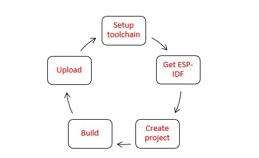

# GETTING STARTED

This document is intended to help users set up the software environment of applications using Espressif ESP32. Through a simple step-by-step process to illustrate how to use ESP-IDF(Espressif IoT Development Framework), including the menu based configuration, compiling the ESP-IDF and firmware download to kalam-32 dev ESP32 microcontroller.

### What You Need
To develop applications for ESP32 you need:
* PC loaded with either Windows, Linux or Mac operating system
*	Toolchain to build the Application for ESP32
* ESP-IDF that essentially contains API for ESP32 and scripts to operate the Toolchain
* A text editor to write programs (Projects) in C 

### Preparation for development



**Setting up the toolchain**

Windows doesn’t have a built-in “make” environment, so as well as installing the toolchain you will need a GNU-compatible environment. We can use the MSYS2 environment to provide this environment.
Toolchain Setup
The quick setup is to download the Windows all-in-one toolchain & MSYS2 zip file from dl.espressif.com:
https://dl.espressif.com/dl/esp32_win32_msys2_environment_and_toolchain-20180110.zip.

Procedures:
1.	Open msys32 mingw32.exe terminal window.
2.	Create new directory 
```c
       mkdir -p /home
```
3.	The newly created directory can be moved by typing cd ~/esp 
```c
      cd /home
```
**Getting ESP-IDF**

Besides the toolchain (that contains programs to compile and build the application), you also need ESP32 specific API / libraries. They are provided by Espressif in ESP-IDF repository. To get it, open terminal, navigate to the directory you want to put ESP-IDF, and clone it using git clone command:
To get all the sub-modules run another command
```c
       cd /home/esp-idf	
       git submodule update --init
 ```

Setup path to ESP-IDF – toolchain program access ESP-IDF using IDF_PATH.Remember to replace back-slashes with forward-slashes in the original Windows path.
```c
       printenv IDF_PATH
```
To check whether the IDF_PATH is set type the command shown below

For further information you can check the link:

https://www.google.com/url?q=https://docs.espressif.com/projects/esp-idf/en/latest/get-started/index.html&sa=D&source=hangouts&ust=1545734829798000&usg=AFQjCNG_f3lSYJ8HYmxZlDHpQpEN1lT-9g

       
