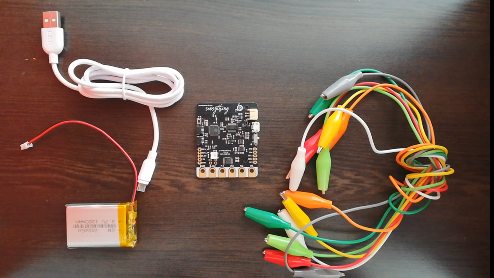

# Sensything - Data Acquistion tool

Sensything being an open source device, is not like any other DAQ tool. It takes the element of data acquistion to newer heights with inbuilt capabilities in the board. With advanced wireless communication like BLE and Wifi, collecting sensor has never been easier and simplified. With such highlights,it is only right for the user to maximise their gain with this device. We have put in some pointers to help the user to get the most from Sensything.

We urge the user to stay open to new ideas and to start exploring..

## How to get the best out of your Sensything?

* **ADC Precison values**

Any sensor reading needs to be accurate and reliable. Only then can any individual understand and question his/her surrounding.Real time data matters and that is how accuracy becomes all the more important. Without using an external ADC, Sensything helps you to collect data with a high leve of accuracy. Monitoring sensor data could not have become more easier.

* **Flexibility in using sensors**

The board itself allows for direct plug ins without a requirement for a breadboard as such. As for the Analog pins on the board, the alligator cables help to connect Analog sensors. In the case of Qwiic, by using a Qwiic connector to a Qwiiic sensor you are good to go. Using the Arduino IDE or the ESP-idf you could program the bpard for the sensor of your choice.

* **Data Storage**

Sesnything offers you a platform to store your sensor data both safely and in a secure manner. Collecting data is a tough task not to mention its important to protect it, so as to avoid loss of data and to avoid directing data through unsafe channels.The data can either be logged on to your mobile device or using a removable storage option (inbuilt SD card slot)

