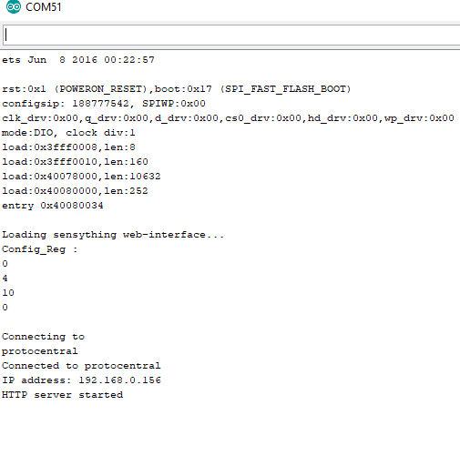

# Getting started

## Sensything with Arduino

This document gives key pointers into how a beginner can get started with the Sensything. It can guide you to enable the connections with your board to the computer and upload your first sketch. The Sensything is programmed using the Arduino Software (IDE), the Integrated Development Environment runs both online and offline. Starting the basics of electronics to more complex projects, the kit will help you control the physical world with sensor and actuators.


## Connecting analog sensors to Sensything
A sensor is a measure of the changes that occur in the physical environment or it's your chance to interface with the physical world. It collects this data and provides an analog voltage as an output. The output range usually varies from 0 to 5 volts, for most of them.
Some basic examples of how to connect to Analog sensors.

### Experiment 1
 1) Alcohol detector

**Aim**: To determine the level of Alcohol in any liquid

**Application**:

Since this sensor has a good level of sensitivity it can be used as a portable alcohol detector.

**Procedure**:
	MQ303A is a semiconductor sensor for Alcohol detection. It has very good sensitivity and fast response to alcohol, suitable for portable alcohol detector just plugging with sensything. Below you find the conversion of adc data to the content of alcohol to be detected with milligram per litre. When the content of alcohol is more than 0.8 it detects the presence of alcohol.


Excerpts from the code:

```c
float adc_data = (float)((bit32*VFSR*1000)/FSR);     //In  mV
float v = (adc_data/10) * (5.0/1024.0);
float mgL = 0.67 * v;

if(mgL > 0.8)
{   
	Serial.print("mg/L : %f \n");
	Serial.print(" Alcohol Detected");
	Serial.println(mgL);
 }
else
{    
	Serial.print("mg/L : %f \n");
	Serial.print(" Alcohol Not Detected");
	Serial.println(mgL);
}  
```

Download the full code: **https://github.com/Protocentral/protocentral_sensything/tree/master/software/Sensything_Arduino/experiments/Analog_Sensors/examples/sensyThing_mq303A**

### Experiment 2
2) Water level check

**Aim**: To determine the level of any liquid

**Application**:
It can determine the continuous liquid level monitoring of water, non-corrosive water or dry fluids.

**Procedure**:
The eTape Liquid Level Sensor is a solid-state sensor with a resistive output that varies with the level of the fluid. It does away with clunky mechanical floats, and easily interfaces with electronic control systems. The eTape sensor's envelope is compressed by the hydrostatic pressure of the fluid in which it is immersed. This results in a change in resistance that corresponds to the distance from the top of the sensor to the surface of the fluid. The sensor's resistive output is inversely proportional to the height of the liquid: the lower the liquid level, the higher the output resistance; the higher the liquid level, the lower the output resistance.
Here we can calculate the output resistance from converting the ADC data in sensything. Below we measure the e-tape liquid level sensor output resistance.


Excerpts from the code:

```c

float Vout = (float)((bit32*VFSR*1000)/FSR);     //In  mV
// convert the value to resistance
 float reading = (1023 / Vout)  - 1;
  reading = 560 / reading;
  Serial.print("Sensor resistance ");
  Serial.println(reading);


```
Download the full code:
**https://github.com/Protocentral/protocentral_sensything/tree/master/software/Sensything_Arduino/experiments/Analog_Sensors/examples/sensyThing_etape**

### Connecting Qwiic sensors to Sensything
One of the most standout features of the Sensything board is that it offers the Qwiic connectivity solution. This is an ode to Sparkfun, whose Qwiic category offers a wide range of sensor breakouts. Why Qwiic? Qwiic connectivity gives an easy and simplified approach called “ Ready to Plug”. You can get a lot more done by getting rid of the breadboard and jumper wires that complicate the sensor readings.

A basic example of how to connect to Qwiic sensor

### Experiment 3
1) Barometric pressure

**Aim**: To determine the Barometric pressure

**Application**:

BMP180 barometric pressure sensor can be used to predict the weather, detect altitude, and measure vertical velocity.
**Procedure**:
This sensor is one of the low-cost solutions for sensing applications related to barometric pressure and temperature. The BMP180 can communicate directly with a microcontroller in the device through I2C or SPI as a variant. The applications for this sensor is navigation, GPS positioning as well as a tracker for hikers. We have enabled Qwiic connection using the channels.


Excerpts from the code:
```c
baseline = getPressure();
Serial.print("baseline pressure: ");
Serial.print(baseline);
```
```c
double a,P;

P = getPressure();             // Get a new pressure reading:
a = pressure.altitude(P,baseline); // Show the relative altitude difference between the new reading and the baseline reading
```
```c
char status;
double T,P;

status = pressure.startTemperature();
status = pressure.getTemperature(T);


status = pressure.startPressure();
status = pressure.getPressure(P,T);
```
Download the full code: **https://github.com/Protocentral/protocentral_sensything/tree/master/software/Sensything_Arduino/experiments/Qwiic/examples/sensything_bmp180**

## Sensything with Web server

The web server came into being to eliminate the need to install any software or application to display sensor values. With a small addition to the programming section, you would be able to read the sensor values on your system. To get started you can follow the basic steps mentioned below to understand how it would work.

### How to Use Sensything along with a Web Server

By equipping Sensything you can turn it into a web server. By accessing that server with a browser running on any computer connected to the same network or the soft-AP available in sensything you can

**Read a value of a sensor (using simple HTML)**

### Step 1: Writing Code to Web Server

Now you can upload/write the code, and it will work straight away. You can create an HTML page for displaying the sensor values, read the HTML contents and send the analog values to the web page.
```c

 String adcValue = MAIN_page; //Read HTML contents
 server.send(200, "text/html", adcValue); //Send web page

```

The ADC value is read from analog channels of sensything and the ADC data is sent to the browser while HTTP data request from the server.

 ```c

  adc_data=pc_ads1220.Read_SingleShot_SingleEnded_WaitForData(MUX_SE_CH0);
  String adcValue = String(convertToMilliV(adc_data));
  server.send(200, "text/plane", adcValue); //Send ADC value only to client ajax request

 ```

 Creating a HTTP request object in the browser to request ADC value from server and process the returned ADC value to update the web page.
 ```c
  var xhttp = new XMLHttpRequest();
  xhttp.onreadystatechange = function() {
  if (this.readyState == 4 && this.status == 200) {
  document.getElementById("ADCValue").innerHTML =
  this.responseText;
  ```

Dont forget to check if you have the ESP32 Dev Module(Sensything) board and Sensything COM port selected, otherwise you will get an error when trying to upload. Open the Serial Monitor at a baud rate of 115200.

Download the full code: **https://github.com/Protocentral/protocentral_sensything/tree/master/software/Sensything_Arduino/sensything_web/examples/sensything_web**

### Step 2: Finding the ESP IP Address

Press the sensything ON/OFF button and it will output the ESP IP address once the code is uploaded on the Serial Monitor.



### Step 3: Accessing the Web Server

Open your browser, type the ESP IP address, and you’ll see the following page. This page is sent by the sensything when you make a request on the ESP IP address. If you take a look at the browser, you can see what is going on in the background. The ESP receives an HTTP request from a new client and displays the analog values.

### Step 4: Testing the Web Server

Let’s test the web server. Connect the analog sensors with sensything and get the live readings of channels in the web server.


## Sensything with BLE

The Sensything board comes with the feature -

**Bluetooth 4.2 / Bluetooth Low Energy (BLE) compatible

In order for the device to connect with the Sensything Application, the Arduino code must be set up.

### How to set up the BLE function?

The Sensything  Application has been designed to simplify the detection of sensor values. With the inbuilt ADC (ADS1220) the precise values can be detected and displayed. Few simple steps:

### Step 1: Writing the code
Using the Arduino IDE, write the code for the sensor of your choice. Refer to the above mentioned examples to get tips on writing the code.

**http://sensything.protocentral.com/sensything-with-arduino.html#step-4-writing-my-first-code-to-sensything**

### Step 2: Connecting the sensor
The next step is to connect the sensors to the Sensything boards. Sensors that can be used are both Analog and Qwiic.

**http://sensything.protocentral.com/sensything-with-arduino.html#connecting-analog-sensors-to-sensything**

### Step 3: Uploading the code on to the board
Connect the Sensything board to your system using a USB cable. Once the code is ready, go on to upload it on to the board.

### Step 4: Using the Sensything Application
Kindly refer to the Introduction video on how to download the Application and how to connect.

**http://sensything.protocentral.com/#making-the-connections**

### Step 5: Reading the sensor values
Kindly refer to the Application section on the main page

**http://sensything.protocentral.com/#understanding-the-sensything-application**
