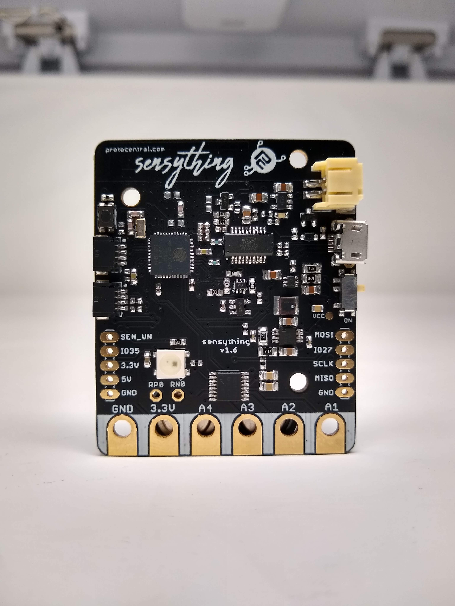

# Welcome to Sensything

Sensything is a Data- acquisition board with the added capabilities of ADC precision (ADS1220). The board contains an ESP-32 microcontroller with Qwiic connectivity that is most suitable for IOT applications. Using one single platform to monitor sensor readings along with the support of an BLE Application and Web server just makes it all the more advanced and simplifies solutions.

If you don't already have one, you can now buy Sensything from [Crowd Supply](https://www.crowdsupply.com/protocentral/sensything)

## Modes of Operation

### * Simple Acquisition Through BLE (Pre-programmed)

Sensything is well equipped for BLE data acquisition. By this, we mean that the sensor is able to connect an Application and transfer the sensor readings. The mode of transmission would be BLE. It limits the complexity of data transfer and also improves the chances of retaining the data in a quick manner. The Sensything Application available on Google store for Android users for free. You can not only read values but also log your data using the Application. The data thus collected will be stored directly on to your phone.

### * Wi-Fi Access Point Mode

In case you wish to limit the number of downloads and software to display the sensor values then you could opt for the Web server. By making small changes in the code you could connect, Sensything can change into a connectable Wifi access point. By pointing your browser to a site you can display the values without any internet connection.

### * Developer Mode

Sensything can be easily programmed. If you are a beginner then you could choose the Arduino IDE to program the board for any sensor. On the other hand, if you are the high-end developer then you could look at the ESP-IDF for programming the mode. Easy and flexible! That is what the Sensything board was designed to do, you can mold it into a device of your choice with very less effort.

### * Data logger mode

Sensything can function as a data logger with the inbuilt SD card option in the board. The inbuilt storage option improvess the chances for a wider scope and flexibility in storing sensor readings. Along with this the data transfer rate becomes faster long with low battery consumption.

<a href="http://sensything.protocentral.com/getting-started.html" target="_blank" rel="noopener" class="btn btn-primary">ITS TIME TO GET STARTED!</a>

## License Information

This product is open source! Both our hardware and software are open source and licensed under the following licenses:

### Hardware

All hardware is released under [Creative Commons Share-alike 4.0 International](http://creativecommons.org/licenses/by-sa/4.0/).

### Software

All software is released under the MIT License(http://opensource.org/licenses/MIT).

Please check [*LICENSE.md*](LICENSE.md) for detailed license descriptions.

THE SOFTWARE IS PROVIDED "AS IS", WITHOUT WARRANTY OF ANY KIND, EXPRESS OR IMPLIED, INCLUDING BUT NOT LIMITED TO THE WARRANTIES OF MERCHANTABILITY, FITNESS FOR A PARTICULAR PURPOSE AND NON-INFRINGEMENT. IN NO EVENT SHALL THE AUTHORS OR COPYRIGHT HOLDERS BE LIABLE FOR ANY CLAIM, DAMAGES OR OTHER LIABILITY, WHETHER IN AN ACTION OF CONTRACT, TORT OR OTHERWISE, ARISING FROM, OUT OF OR IN CONNECTION WITH THE SOFTWARE OR THE USE OR OTHER DEALINGS IN THE SOFTWARE.
