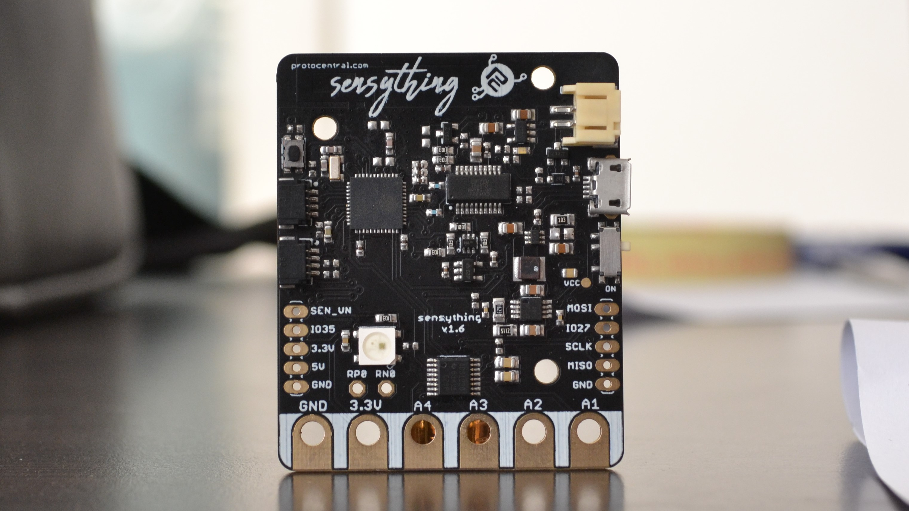
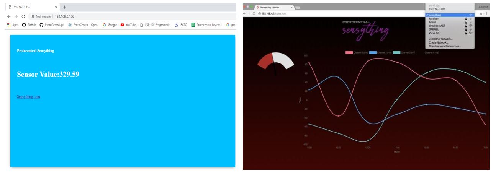

###### Welcome to Sensything

Sensything is a Data- acquisition board with the added capabilities of ADC precision (ADS1220). The board contains an ESP-32 microcontroller with Qwiic connectivity that is most suitable for IOT applications. Using one single platform to monitor sensor readings along with the support of an BLE Application and Web server just makes it all the more advanced and simplifies solutions.

If you don't already have one, you can now buy Sensything from [Crowd Supply](https://www.crowdsupply.com/protocentral/sensything)

#### HIGHLIGHTS

**Microcontroller**: ESP-PICO-D4 SIP with 4 MB Flash 

**ADC**: Texas Instruments ADS1220 24-bit Sigma-Delta

 **Analog characteristics**:                                                                 
* 4 channels single-ended, 2-channel fully differential                                   
* Full-scale input range: ± 2.048 V to ± 0.016 V (adjustable gain).                      
* Sampling rate: 20 samples/second (SPS) to 2000 SPS.                                    
* Current sources: On-board excitation current sources adjustable from 10 uA to  1500 uA.
* Built-in 2.048 V voltage reference with 5 ppm/°C drift.                                
* Built-in temperature sensor with 0.5°C accuracy.                                       

**Wireless interface**:                                
* 2.4 GHz radio with on-board PCB antenna               
* Wi-Fi station and Access Point (AP) mode              
* Bluetooth 4.2 / Bluetooth Low Energy (BLE) compatible 

**Ports and I/O**:                                            
* Board-edge alligator clip compatible analog input connectors 
* 2x Sparkfun Qwiic-compatible I2C ports                       
* USB-CDC (on-board FT230X)                                    
* 4x general-purpose I/O pins                                  
* 1 WS2812 RGB user-controllable LED for indication            
* MicroSD card slot for on-board data logging                  

**Power supply**:                                                          
* Li-ion battery (3.7 V, 1000 mAH) as power source                       
* On-board USB battery charger                                           
* On-board 5 V DC/DC boost converter with low-noise LDO for analog power 
* 3.3 V digital supply voltage                                           

**Dimensions**: 47x57 mm (length, width), 5 mm height (board only), 12 mm height (with included battery stacked)

#### Modes of operation

##### * BLE mode 

Sensything is well equipped for BLE data acquisition. By this, we mean that the sensor is able to connect an Application and transfer the sensor readings. The mode of transmission would be BLE. It limits the complexity of data transfer and also improves the chances of retaining the data in a quick manner. The Sensything Application available on Google store for Android users for free. You can not only read values but also log your data using the Application. The data thus collected will be stored directly on to your phone.

 
    

 
##### * Webserver Mode

In case you wish to limit the number of downloads and software to display the sensor values then you could opt for the Web server. By making small changes in the code you could cooect your device and display sensor vales on your system. By pointing your browser to a site you can display the values without any internet connection. You can set up the Webserver with the Arduino and ESP-IDF as shown in the image below.

##### * Developer Mode

Sensything can be easily programmed. If you are a beginner then you could choose the Arduino IDE to program the board for any sensor. On the other hand, if you are the high-end developer then you could look at the ESP-IDF for programming the mode. Easy and flexible! That is what the Sensything board was designed to do, you can mold it into a device of your choice with very less programming knowlegde required.

##### * Data logger mode

Sensything can function as a data logger with the inbuilt SD card option in the board. The inbuilt storage option improvess the chances for a wider scope and flexibility in storing sensor readings. Along with this the data transfer rate becomes faster long with low battery consumption. The data logging option is also avaialble in the Sensything Application.

 
    

   

