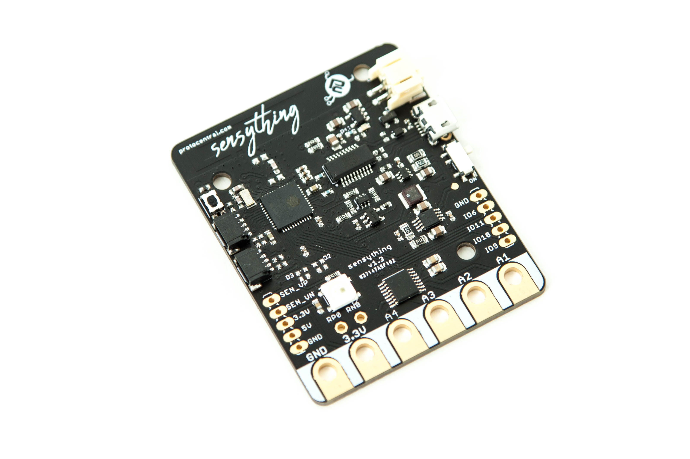

Welcome to Sensything

Sensything is a Data- acquisition board with the added capabilities of ADC precision (ADS1220). The board contains an ESP-32 microcontroller with Qwiic connectivity that is most suitable for IOT applications. Using one single platform to monitor sensor readings along with the support of an BLE Application and Web server just makes it all the more advanced and simplifies solutions.

If you don't already have one, you can now buy Sensything from [Crowd Supply](https://www.crowdsupply.com/protocentral/sensything)

## What’s in the box?
* 1x Sensything main Board
* 1x 1000 mAH, 3.7V Li-Po battery
* 10x alligator cables
* 1x micro USB cable

If you have purchased the *Sensything - board only* version then you will have to bring your own battery, and cables.
This video throws light on how to set up your Sensything device. Get set Go!
<iframe width="640" height="360" src="https://player.vimeo.com/video/306863926" frameborder="0" allowFullScreen mozallowfullscreen webkitAllowFullScreen></iframe>

<a href="http://sensything.protocentral.com/getting-started.html" target="_blank" rel="noopener" class="btn btn-primary">ITS TIME TO GET STARTED!</a>

## License Information

This product is open source! Both, our hardware and software are open source and licensed under the following licenses:

### Hardware

All hardware is released under [Creative Commons Share-alike 4.0 International](http://creativecommons.org/licenses/by-sa/4.0/).

### Software

All software is released under the MIT License(http://opensource.org/licenses/MIT).

Please check [*LICENSE.md*](LICENSE.md) for detailed license descriptions.

THE SOFTWARE IS PROVIDED "AS IS", WITHOUT WARRANTY OF ANY KIND, EXPRESS OR IMPLIED, INCLUDING BUT NOT LIMITED TO THE WARRANTIES OF MERCHANTABILITY, FITNESS FOR A PARTICULAR PURPOSE AND NON-INFRINGEMENT. IN NO EVENT SHALL THE AUTHORS OR COPYRIGHT HOLDERS BE LIABLE FOR ANY CLAIM, DAMAGES OR OTHER LIABILITY, WHETHER IN AN ACTION OF CONTRACT, TORT OR OTHERWISE, ARISING FROM, OUT OF OR IN CONNECTION WITH THE SOFTWARE OR THE USE OR OTHER DEALINGS IN THE SOFTWARE.
