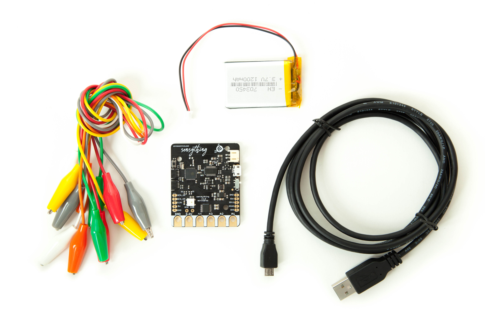

Sensything is a Data- acquisition board with the added capabilities of ADC precision (ADS1220). The board contains an ESP-32 microcontroller with Qwiic connectivity that is most suitable for IOT applications. Using one single platform to monitor sensor readings along with the support of an BLE Application and Web server just makes it all the more advanced and simplifies solutions.

If you don't already have one, you can now buy Sensything from [Crowd Supply](https://www.crowdsupply.com/protocentral/sensything)

# Getting started with the Sensything Basic kit

The Sensything basic kit is put together to work **out of the box**, which means that is is ready to without any additional programming required.

### What’s in the box?
* 1x Sensything main Board
* 1x 1000 mAH, 3.7V Li-Po battery
* 10x alligator cables
* 1x micro USB cable

If you have purchased the *Sensything - board only* version then you will have to bring your own battery, and cables.



### Power it up

This video throws light on how to set up your Sensything device.
Video:Power it up

### Install the Sensything app for Android

Download the App and connecting couldn’t have been much easier.
Video: Play store

### Using the App
Easy connect with just a click. Pay attention to the RGB indication.
Video: Using the App

# Connecting analog sensors to Sensything

A sensor is a measure of the changes that occur in the physical environment, or it's your chance to interface with the physical world. It collects this data and provides an analog voltage as an output.The output range usually varies from 0 to 5 volts, for most of them.

Some basic examples of how to connect to Analog sensors

# Using Sensything with Arduino

Welcome to Sensything with Arduino! Before you start measuring the world around you, you will need to set up the Arduino IDE software to work with the ESP32 platform.

Once you have Arduino setup for the ESP32 or if you have already worked with that, let's look at some example code to read the analog channels.

A header file is generally used to define all the functions, variables and constants contained in any function library that you might want to use, define the pin number of ads1220 Chipselect and DRDY.

```c
#include "Protocentral_ADS1220.h"
#define ADS1220_CS_PIN    4
#define ADS1220_DRDY_PIN  34
```
Initialize the onboard ADS1220 ADC with begin
```c
void setup()
{
    Serial.begin(9600);

    pc_ads1220.begin(ADS1220_CS_PIN,ADS1220_DRDY_PIN);

    pc_ads1220.set_data_rate(DR_330SPS);
    pc_ads1220.set_pga_gain(PGA_GAIN_1);
    pc_ads1220.set_conv_mode_single_shot(); //Set Single shot mode
 }
```
In the loop function below we get the ADC data for Channel 0 The same code can be applied to channel 1, channel 2 and channel 3.

```c
void loop()
{
    adc_data=pc_ads1220.Read_SingleShot_SingleEnded_WaitForData(MUX_SE_CH0);
    Serial.print("\n\nCh1 (mV): ");
    Serial.print(convertToMilliV(adc_data));
    delay(100);  
}
```  
Converting the adc data into millivolt
```c
float convertToMilliV(int32_t i32data)
{
    return (float)((i32data*VFSR*1000)/FULL_SCALE);
}
```

Getting the above code is as easy as installing the Arduino library https://github.com/Protocentral/Protocentral_ADS1220 and loading the simple ads1220 data acquisition example from  the Arduino IDE's menu: *File > Open > Protocentral_ADS1220*.


Upload the code to the Sensything and you can get the 4-channel analog readings in the Serial Monitor.


# License Information

This product is open source! Both, our hardware and software are open source and licensed under the following licenses:

## Hardware

All hardware is released under [Creative Commons Share-alike 4.0 International](http://creativecommons.org/licenses/by-sa/4.0/).


## Software

All software is released under the MIT License(http://opensource.org/licenses/MIT).

Please check [*LICENSE.md*](LICENSE.md) for detailed license descriptions.

THE SOFTWARE IS PROVIDED "AS IS", WITHOUT WARRANTY OF ANY KIND, EXPRESS OR IMPLIED, INCLUDING BUT NOT LIMITED TO THE WARRANTIES OF MERCHANTABILITY, FITNESS FOR A PARTICULAR PURPOSE AND NON-INFRINGEMENT. IN NO EVENT SHALL THE AUTHORS OR COPYRIGHT HOLDERS BE LIABLE FOR ANY CLAIM, DAMAGES OR OTHER LIABILITY, WHETHER IN AN ACTION OF CONTRACT, TORT OR OTHERWISE, ARISING FROM, OUT OF OR IN CONNECTION WITH THE SOFTWARE OR THE USE OR OTHER DEALINGS IN THE SOFTWARE.
