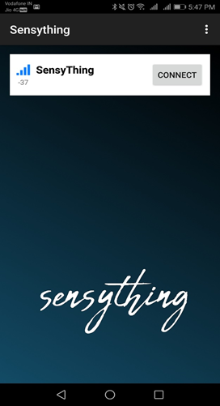
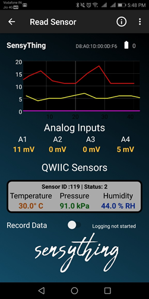

# Sensything- “Out of the Box”
One unique feature that stands out with the Sensything is its “out of the box” approach. You may wonder what is so unique about it. Where else can you find a board that you can immediately use once you unbox it. The board is **“READY TO USE”**. For all you eager enthusiasts, who cannot wait to explore new hardware then do go for it. We would be happy to hear from you!

  
 **NO ADDITIONAL PROGRAMMING REQUIRED** 

## What’s in the box?
* 1x Sensything main Board
* 1x 1000 mAH, 3.7V Li-Po battery
* 10x alligator cables
* 1x micro USB cable

If you have purchased the *Sensything - board only* version then you will have to bring your own battery, and cables.
This video throws light on how to set up your Sensything device. Get set Go!
<iframe width="640" height="360" src="https://player.vimeo.com/video/306863926" frameborder="0" allowFullScreen mozallowfullscreen webkitAllowFullScreen></iframe>

### Making the connections

1) Downloading the App and connecting the device

**Note**: The Sensything App is currently available for Android users on Google Play store. The ios version will be coming soon. Stay tuned for updates!
<iframe width="640" height="360" src="https://player.vimeo.com/video/307040678" frameborder="0" allowFullScreen mozallowfullscreen webkitAllowFullScreen></iframe>

2) Basic connections of Analog sensors

They can be listed as follows:

|Sensything pin label| Analog Channel   |
|----------------- |:--------------------:|
| A1             | Channel 1                  |            
| A2       | Channel 2                   |
| A3            | Channel 3                   |  
| A4             | Channel 4                  |  
| 3V3              | Supply - Board which supports 3.3V   |
| GND                             | Gnd |

A short video suggests how to connect a basic analog sensor like the Piezo vibration sensor to Sensything.

<iframe width="640" height="360" src="https://player.vimeo.com/video/307550473" frameborder="0" allowFullScreen mozallowfullscreen webkitAllowFullScreen></iframe>

### Understanding the Sensything Application

    

This above image is a screenshot of the opening page of the Application. This page displays the following information
* Details of the detected Sensything device
* The"Connect" option for the device.

    

The main page of the Application can be segmented as follows:
* **Graphical representation** - This depicts the changes in the readings of the sensors. All major and minor fluctuations are picked up.
* **Analog channels** - The four channels gives the ADC values received from the plug ins on the board.
* **Qwiic section** - Incase any qwiic connection is made the values will be shown there.
* **Data logging** - Using the Application you can log your data, so that the data is saved directly to your mobile device.

**Note**: On the right hand corner there is a battery indicator, this detects the level of charge in the Sensything device.
