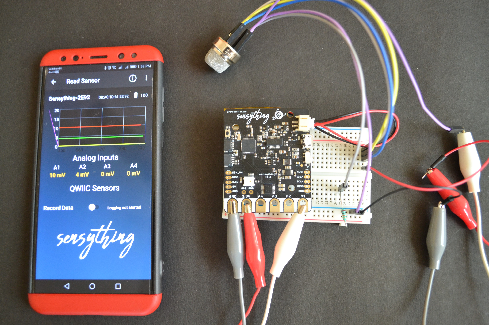

### Using with ESP IDF


If you would like to take things up a notch, then we would suggest you program Sensything using the ESP IDF. This section is intended to help users set up the software environment of applications using Espressif ESP32. Through a simple step-by-step process to illustrate how to use ESP-IDF(Espressif IoT Development Framework).

#### What You Need?

To develop applications for ESP32 you need:
* PC loaded with either Windows, Linux or Mac operating system
* Toolchain to build the Application for ESP32
* ESP-IDF that essentially contains API for ESP32 and scripts to operate the Toolchain
* A text editor to write programs (Projects) in C

#### Preparation for development

There are three simple steps in the process of development:

* **Setup of Toolchain**
* **Getting of ESP-IDF from GitHub**
* **Installation and configuration**

**Step 1: Setting up the toolchain**

Windows don’t have a built-in “make” environment, so as well as installing the toolchain you will need a GNU-compatible environment. We can use the MSYS2 environment to provide this environment. The quick setup is to download the Windows all-in-one toolchain & MSYS2 zip file from dl.espressif.com: [Toolchain Setup- Windows](https://dl.espressif.com/dl/esp32_win32_msys2_environment_and_toolchain-20180110.zip)

The quick setup is to download the linux all-in-one toolchain from Espressif website:[Toolchain Setup 64-bit Linux](https://dl.espressif.com/dl/xtensa-esp32-elf-linux64-1.22.0-80-g6c4433a-5.2.0.tar.gz) and [Toolchain Setup 32-bit Linux](https://dl.espressif.com/dl/xtensa-esp32-elf-linux32-1.22.0-80-g6c4433a-5.2.0.tar.gz) 

The quick setup is to download the ESP32 toolchain for macOS all-in-one toolchain from Espressif website:[Toolchain Setup macOS](https://dl.espressif.com/dl/xtensa-esp32-elf-osx-1.22.0-80-g6c4433a-5.2.0.tar.gz) 


**Step 2: Getting ESP-IDF**

Besides the toolchain (that contains programs to compile and build the application), you also need ESP32 specific API / libraries. They are provided by Espressif in [ESP-IDF repository](https://www.google.com/url?q=https://docs.espressif.com/projects/esp-idf/en/latest/get-started/index.html). To get it, open terminal, navigate to the directory you want to put ESP-IDF and clone it from espressif repository in github.


**Step 3: Setting up**

To set up the software environment and get esp-idf to follow the instructions given in the link below for [Windows](https://docs.espressif.com/projects/esp-idf/en/latest/get-started/windows-setup.html), [Linux](https://docs.espressif.com/projects/esp-idf/en/latest/get-started/linux-setup.html), [Mac OS](https://docs.espressif.com/projects/esp-idf/en/latest/get-started/macos-setup.html)

To showcase how to program the Sensything board with ESP idf we have an example illustrated below:

**Experiment 1 - Gas Leakage detector**

#### * Objective

To determine the gas leakage detection (home and industry)

##### * Application

Since this sensor has a high sensitivity and fast response time, it can be used as a portable gas and smoke detector suitable for detecting H2, LPG, CH4, CO, Alcohol, Smoke or Propane.

##### * Procedure

MQ2 is a semiconductor sensor for Gas Detection. When we apply a bias to the sensor it takes some “burn-in time” that is for to sensor getting warm, after that the electrochemical sensor detects specific gas and varies the current flow through the sensor. Hence we get analog output ranges depends on Gas concentration. It has very high sensitivity and fast response time, The voltage measured from ads1220 in Sensything and converted to the sensor voltage and gas concentration is calculated. The concentration of gas is sent through BLE and displayed in the Sensything mobile application.



#### * Pin mapping and connection instructions:

<style type="text/css">
.tg  {border-collapse:collapse;border-spacing:0;}
.tg td{font-family:Arial, sans-serif;font-size:14px;padding:10px 5px;border-style:solid;border-width:1px;overflow:hidden;word-break:normal;border-color:black;}
.tg th{font-family:Arial, sans-serif;font-size:14px;font-weight:normal;padding:10px 5px;border-style:solid;border-width:1px;overflow:hidden;word-break:normal;border-color:black;}
.tg .tg-c3ow{border-color:inherit;text-align:center;vertical-align:top}
.tg .tg-uys7{border-color:inherit;text-align:center}
.tg .tg-xldj{border-color:inherit;text-align:left}
</style>
<table class="tg">
  <tr>
    <th class="tg-xldj"><span style="font-weight:600">Sensything pin label</span></th>
    <th class="tg-uys7"><span style="font-weight:600">MQ2 Gas Sensor</span></th>
  </tr>
  <tr>
    <td class="tg-uys7">3V3</td>
    <td class="tg-uys7">A</td>
  </tr>
  <tr>
    <td class="tg-c3ow">3V3</td>
    <td class="tg-c3ow">H</td>
  </tr>
  <tr>
    <td class="tg-c3ow">3V3</td>
    <td class="tg-c3ow">A1</td>
  </tr>
  <tr>
    <td class="tg-c3ow">A1</td>
    <td class="tg-c3ow">B</td>
  </tr>
  <tr>
    <td class="tg-c3ow">GND</td>
    <td class="tg-c3ow">H</td>
  </tr>
  <tr>
    <td class="tg-c3ow">GND</td>
    <td class="tg-c3ow">B1 - Across resistor 10K</td>
  </tr>
</table>

&ensp;

<style type="text/css">
.tg  {border-collapse:collapse;border-spacing:0;}
.tg td{font-family:Arial, sans-serif;font-size:14px;padding:10px 5px;border-style:solid;border-width:1px;overflow:hidden;word-break:normal;border-color:black;}
.tg th{font-family:Arial, sans-serif;font-size:14px;font-weight:normal;padding:10px 5px;border-style:solid;border-width:1px;overflow:hidden;word-break:normal;border-color:black;}
.tg .tg-u8t5{font-family:Tahoma, Geneva, sans-serif !important;;text-align:center}
.tg .tg-0lax{text-align:left;vertical-align:top}
</style>
<table class="tg">
  <tr>
    <th class="tg-u8t5"><span style="font-weight:bold">Connection Instructions</span></th>
  </tr>
  <tr>
    <td class="tg-0lax">- Place the etape MQ2 gas sensor to any of the analog pins A1, A2, A3 and A4.</td>
  </tr>
  <tr>
    <td class="tg-0lax">- Here we are using A1.</td>
  </tr>
  <tr>
    <td class="tg-0lax">- Using a breadboard connect a pin A, pin H, pin A1 to Vcc in Sensything.</td>
  </tr>
  <tr>
    <td class="tg-0lax">- Connect pin B of MQ2 with Analog1 in Sensything.</td>
  </tr>
  <tr>
    <td class="tg-0lax">- Using a breadboard connect a resistor between pin B1 in sensor and GND in the breadboard.</td>
  </tr>
  <tr>
    <td class="tg-0lax">- Connect GND across the resistor from pin B1 with the GND pin in Sensything.</td>
  </tr>
</table>


##### * Excerpts from the code:

```c
float vout = (float)((ads1220_data_32*VFSR*1000)/FSR); 
sensor_volt= vout /1024*5.0;                              // Measuring mq2 gas sensor voltage
printf("Sensor voltage: %f \n",sensor_volt);
RS_gas = (5.0-sensor_volt)/sensor_volt;                  // Calculating gas concentration
printf("Gas Concentration : %f \n",RS_gas );
int32_t ble_vout = (int32_t) (sensor_volt * 100);           // Sending the sensor value through ble
```

[Download the Smoke sensor code](https://www.google.com/url?q=https://github.com/Protocentral/protocentral_sensything/tree/master/software/Sensything_esp-idf/Sensything_experiments/Analog_Sensors/MQ2_GasSensor&sa=D&source=hangouts&ust=1547734061557000&usg=AFQjCNFY6pU_dnog8ALqcdMeEP1rqzBgyg)


