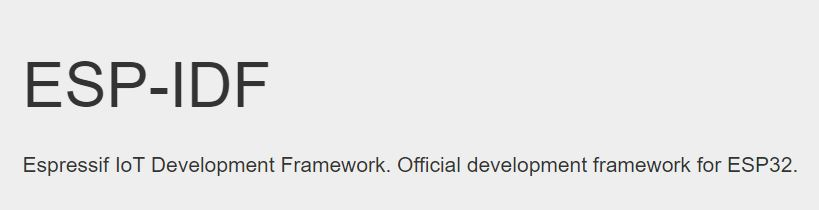

# Using with ESP IDF



If you would like to take things up a notch, then we would suggest you to program Sensything using the ESP IDF. This section is intended to help users set up the software environment of applications using Espressif ESP32. Through a simple step-by-step process to illustrate how to use ESP-IDF(Espressif IoT Development Framework).

## What You Need?

To develop applications for ESP32 you need:
* PC loaded with either Windows, Linux or Mac operating system
* Toolchain to build the Application for ESP32
* ESP-IDF that essentially contains API for ESP32 and scripts to operate the Toolchain
* A text editor to write programs (Projects) in C

### Preparation for development

There are three simple steps in the process to development:

* **Setup of Toolchain**
* **Getting of ESP-IDF from GitHub**
* **Installation and configuration**

### Step 1: Setting up the toolchain

Windows doesn’t have a built-in “make” environment, so as well as installing the toolchain you will need a GNU-compatible environment. We can use the MSYS2 environment to provide this environment.The quick setup is to download the Windows all-in-one toolchain & MSYS2 zip file from dl.espressif.com:[Toolchain Setup](https://dl.espressif.com/dl/esp32_win32_msys2_environment_and_toolchain-20180110.zip)

**Procedures**:

1.	Open msys32 mingw32.exe terminal window.
2.	Create new directory
```c
mkdir -p /home
```
3.	The newly created directory can be moved by typing cd ~/esp
```c
cd /home
```
### Step 2: Getting ESP-IDF

Besides the toolchain (that contains programs to compile and build the application), you also need ESP32 specific API / libraries. They are provided by Espressif in ESP-IDF repository. To get it, open terminal, navigate to the directory you want to put ESP-IDF, and clone it using git clone command:
To get all the sub-modules run another command
```c
cd /home/esp-idf
git submodule update --init
 ```

Setup path to ESP-IDF – toolchain program access ESP-IDF using IDF_PATH.Remember to replace back-slashes with forward-slashes in the original Windows path.
```c
printenv IDF_PATH
```
### Step 3: Setting up

To setup the software environment and get esp-idf follow the instructions given in the link below.

[SETUP ESP IDF](https://www.google.com/url?q=https://docs.espressif.com/projects/esp-idf/en/latest/get-started/index.html)

To showcase how to program the Sensything board with ESP idf we have an example illustrated below:

## Experiment 1 - Gas Leakage detector

### Objective

To determine the gas leakage detection (home and industry)

### Application

Since this sensor has a high sensitivity and fast response time, it can be used as a portable gas and smoke detector suitable for detecting H2, LPG, CH4, CO, Alcohol, Smoke or Propane.

### Procedure

MQ2 is a semiconductor sensor for Gas Detection. When we apply bias to the sensor it takes some “burn-in time” that is for to sensor getting warm, after that the electrochemical sensor detects specific gas and varies the current flow through the sensor. Hence we get analog output ranges depends on Gas concentration. It has very high sensitivity and fast response time, The voltage measured from ads1220 in Sensything and converted to the sensor voltage and gas concentration is calculated. The concentration of gas is sent through ble and displayed in the Sensything mobile application.

### Excerpts from the code:

```c
float vout = (float)((ads1220_data_32*VFSR*1000)/FSR); 
sensor_volt=vout /1024*5.0;                              // Measuring mq2 gas sensor voltage
printf("Sensor_ volt: %f \n",sensor_volt);
RS_gas = (5.0-sensor_volt)/sensor_volt;                  // Calculating gas concentration
printf("Gas Concentration : %f \n",RS_gas );
int32_t ble_vout = (int32_t) (channel1 * 100);           // Sending the analog channel value through ble
```

Download the Smoke sensor code
