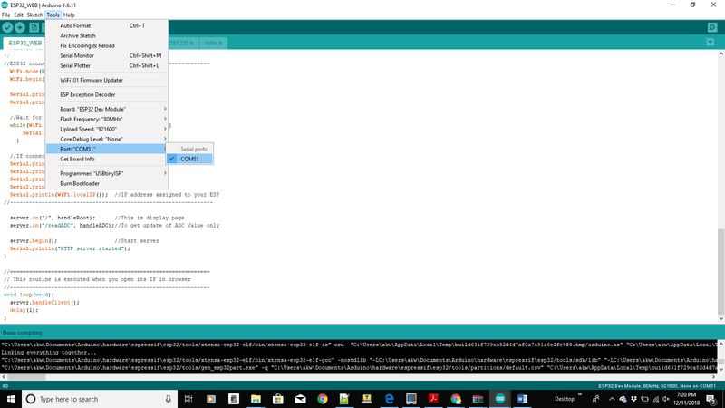
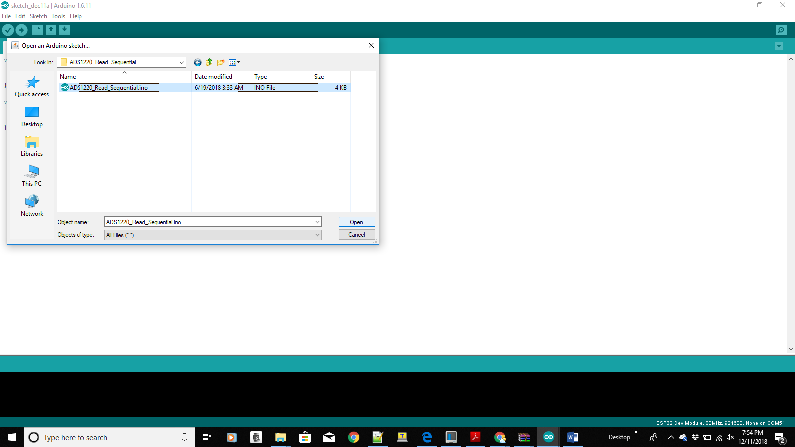
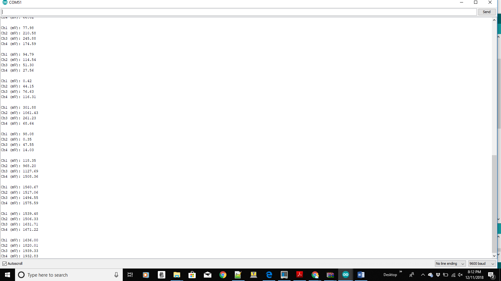
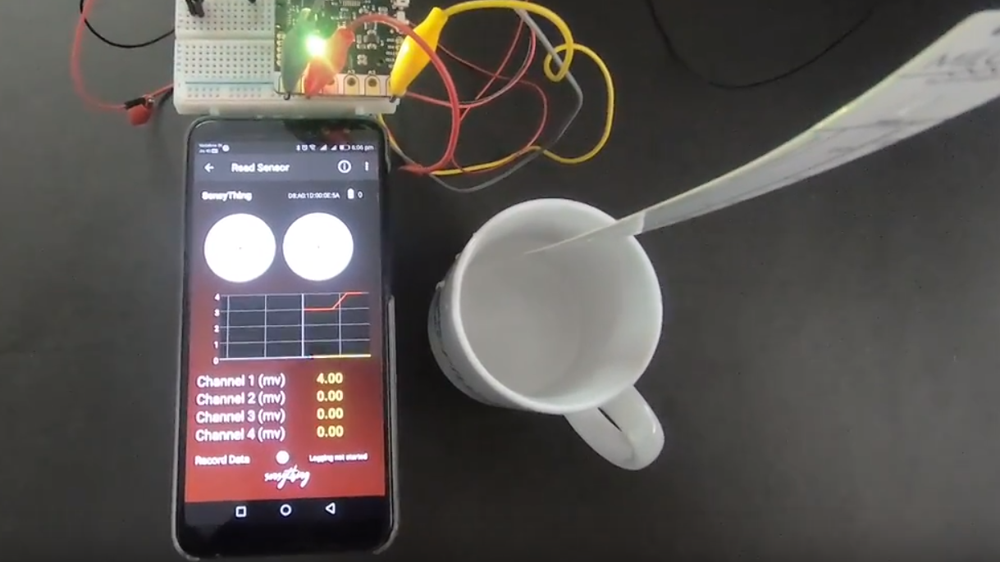

# Sensything with Arduino

This document explains how to connect your sensything to the computer and upload your first sketch. The Sensything is programmed using the Arduino Software (IDE), the Integrated Development Environment runs both online and offline. Starting the basics of electronics, to more complex projects, the kit will help you control the physical world with sensor and actuators.

## Setting up Arduino for ESP32

Welcome to sensything with arduino! Before you start controlling the world around you, you'll need to set up the software to program your Sensything.

### Step 1: Download and Install the IDE
The Arduino Software (IDE) allows you to write programs and upload them to your sensything. Now you require arduino Desktop IDE you can download the latest version for windows, linux and Mac OS using the below link . **https://www.arduino.cc/en/Main/Software#download**


**Note**: Once downloaded, install the IDE and ensure that you enable most (if not all) of the options, including the drivers.

### Step 2: Get the Sensything COM Port Number
Next, you'll need to connect the Sensything board to the computer. This is done via a USB connection. When the Sensything is connected, the operating system should recognize the board as a generic COM port. The easiest way to do this is to type device manager into Windows Search and select Device Manager when it shows.


In the Device Manager window, look for a device under Ports (COM & LPT), and chances are the Arduino will be the only device on the list

### Step 3: Configure the IDE
Now that we have determined the COM port that the Arduino is on, it's time to load the Arduino IDE and configure it to use the same device and port.You have to install the esp32 platform   in the arduino IDE to find esp32 board in board manager.For installing esp32 platform follow up th link: https://github.com/espressif/arduino-esp32/blob/master/docs/arduino-ide/boards_manager.md .You can start by loading the IDE. When it is loaded, navigate to Tools > Board > Esp32 dev module.


Next, you must tell the IDE which COM port the Sensything is on. To do this, navigate to Tools > Port > COM51. Obviously, if your Sensything is on a different port, select that port instead.



### Step 4: Writing my first code to Sensything
A header file is generally used to define all the functions, variables and constants contained in any function library that you might want to use, define the pin number of ads1220 Chip select and DRDY.

```c
#include "Protocentral_ADS1220.h"
#define ADS1220_CS_PIN    4
#define ADS1220_DRDY_PIN  34
```
Initialize the onboard ADS1220 ADC with begin
```c
void setup()
{
    Serial.begin(9600);

    pc_ads1220.begin(ADS1220_CS_PIN,ADS1220_DRDY_PIN);

    pc_ads1220.set_data_rate(DR_330SPS);
    pc_ads1220.set_pga_gain(PGA_GAIN_1);
    pc_ads1220.set_conv_mode_single_shot(); //Set Single shot mode
 }
```
In the loop function below we get the ADC data for Channel 0,the same logic can be applied to read channel 1, channel 2 and channel 3.

```c
void loop()
{
    adc_data=pc_ads1220.Read_SingleShot_SingleEnded_WaitForData(MUX_SE_CH0);
    Serial.print("\n\nCh1 (mV): ");
    Serial.print(convertToMilliV(adc_data));
    delay(100);  
}
```  
Converting the adc data into millivolt
```c
float convertToMilliV(int32_t i32data)
{
    return (float)((i32data*VFSR*1000)/FULL_SCALE);
}
```
Getting the above code is as easy as installing the Arduino library https://github.com/Protocentral/Protocentral_ADS1220 and loading the simple ads1220 data acquisition example from  the Arduino IDE's menu: File > Open > Protocentral_ADS1220.





### Step 5: Compiling and Uploading

Compile the code and check for compilation without error and upload the code to sensything so you get the 4-channel analog readings printed in the Serial Monitor.




Its time to get started with some sensors to get the Real time output. We have showcased this in the following experiments with both Analog and Qwiic sensors.

## Connecting analog sensors to Sensything
A sensor is a measure of the changes that occur in the physical environment, or it's your chance to interface with the physical world. It collects this data and provides an analog voltage as an output. The output range usually varies from 0 to 5 volts, for most of them.
Some basic examples of how to connect to Analog sensors.

### Experiment 1
 1) Alcohol detector

**Aim**: To determine the level of Alcohol in any liquid

**Application**:

Since this sensor has a good level of sensitivity it can be used as a portable alcohol detector.

**Procedure**:
	MQ303A is a semiconductor sensor for Alcohol detection. It has very good sensitivity and fast response to alcohol, suitable for portable alcohol detector just plugging with sensything. Below you find the conversion of adc data to the content of alcohol to be detected with milligram per litre. When the content of alcohol is more than 0.8 it detects the presence of alcohol.


Excerpts from the code:

```c
float adc_data = (float)((bit32*VFSR*1000)/FSR);     //In  mV
float v = (adc_data/10) * (5.0/1024.0);
float mgL = 0.67 * v;

if(mgL > 0.8)
{   
Serial.print("mg/L : %f \n");
Serial.print(" Alcohol Detected");
Serial.println(mgL);
 }
else
{    Serial.print("mg/L : %f \n");
Serial.print(" Alcohol Not Detected");
Serial.println(mgL);

}  

```

### Experiment 2
2) Water level check

**Aim**: To determine the level of any liquid

**Application**:
It can determine the continuous liquid level monitoring of water, non-corrosive water or dry fluids.

**Procedure**:
The eTape Liquid Level Sensor is a solid-state sensor with a resistive output that varies with the level of the fluid. It does away with clunky mechanical floats, and easily interfaces with electronic control systems. The eTape sensor's envelope is compressed by the hydrostatic pressure of the fluid in which it is immersed. This results in a change in resistance that corresponds to the distance from the top of the sensor to the surface of the fluid. The sensor's resistive output is inversely proportional to the height of the liquid: the lower the liquid level, the higher the output resistance; the higher the liquid level, the lower the output resistance.
Here we can calculate the output resistance from converting the ADC data in sensything. Below we measure the e-tape liquid level sensor output resistance.



Excerpts from the code:

```c

float Vout = (float)((bit32*VFSR*1000)/FSR);     //In  mV
// convert the value to resistance
 float reading = (1023 / Vout)  - 1;
  reading = 560 / reading;
  Serial.print("Sensor resistance ");
  Serial.println(reading);


```

## Connecting Qwiic sensors to Sensything
One of the most standout features of the Sensything board is that it offers the Qwiic connectivity solution. This is an ode to Sparkfun, whose Qwiic category offers a wide range of sensor breakouts. Why Qwiic? Qwiic connectivity gives an easy and simplified approach called “ Ready to Plug”. You can get a lot more done by getting rid of the breadboard and jumper wires that complicate the sensor readings.

A basic example of how to connect to Qwiic sensor

### Experiment 3
1) Barometric pressure

**Aim**: To determine the Barometric pressure

**Application**:
BMP180 barometric pressure sensor can be used to predict the weather, detect altitude, and measure vertical velocity.
**Procedure**:
This sensor is one of the low-cost solutions for sensing applications related to barometric pressure and temperature. The BMP180 can communicate directly with a microcontroller in the device through I2C or SPI as a variant. The applications for this sensor is navigation, GPS positioning as well as a tracker for hikers. We have enabled Qwiic connection using the channels.


Excerpts from the code:
```c
baseline = getPressure();
Serial.print("baseline pressure: ");
Serial.print(baseline);
```
```c
double a,P;

P = getPressure();             // Get a new pressure reading:
a = pressure.altitude(P,baseline); // Show the relative altitude difference between the new reading and the baseline reading
```
```c
char status;
double T,P;

status = pressure.startTemperature();
status = pressure.getTemperature(T);


status = pressure.startPressure();
status = pressure.getPressure(P,T);
```

**Note**:Web interface for Sensything .. Coming soon
