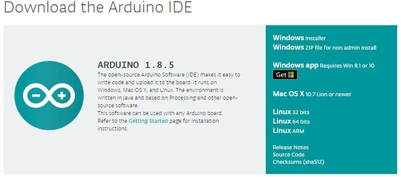
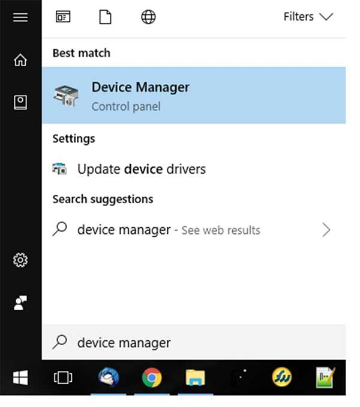
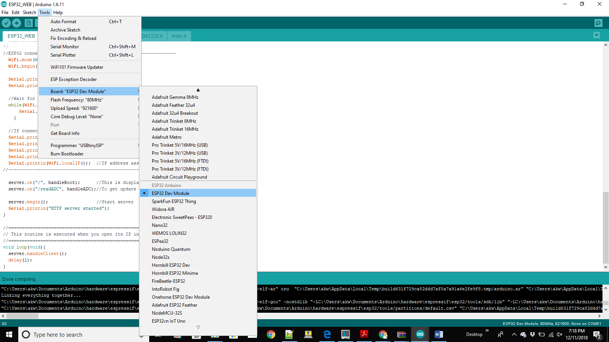

# Setting up Arduino for use with Sensything

This document explains how to connect your Sensything to the computer and upload your first sketch. The Sensything is programmed using the Arduino Software (IDE), the Integrated Development Environment runs both online and offline. Starting the basics of electronics, to more complex projects, the kit will help you control the physical world with sensor and actuators.

Setting up Arduino to ESP32
Welcome to sensything with arduino! Before you start controlling the world around you, you'll need to set up the software to program your Sensything.

### Step 1: Download and Install the IDE
The Arduino Software (IDE) allows you to write programs and upload them to your sensything. Now you require arduino Desktop IDE you can download the latest version using the below link. **https://www.arduino.cc/en/Main/Software#download**

Once downloaded, install the IDE and ensure that you enable most (if not all) of the options, INCLUDING the drivers.

### Step 2: Get the Sensything COM Port Number
Next, youll need to connect the Sensything board to the computer. This is done via a USB connection. When the Sensything is connected, the operating system should recognize the board as a generic COM port. The easiest way to do this is to type device manager into Windows Search and select Device Manager when it shows.

In the Device Manager window, look for a device under �Ports (COM & LPT), and chances are the Arduino will be the only device on the list

### Step 3: Configure the IDE
Now that we have determined the COM port that the Arduino is on, it's time to load the Arduino IDE and configure it to use the same device and port. Start by loading the IDE. Once it's loaded, navigate to Tools > Board > Esp32 dev module.

Next, you must tell the IDE which COM port the Sensything is on. To do this, navigate to Tools > Port > COM51. Obviously, if your Sensything is on a different port, select that port instead.
![Selecting port](images//selecting port.png]
